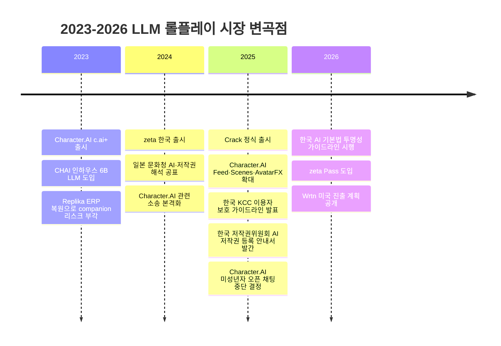
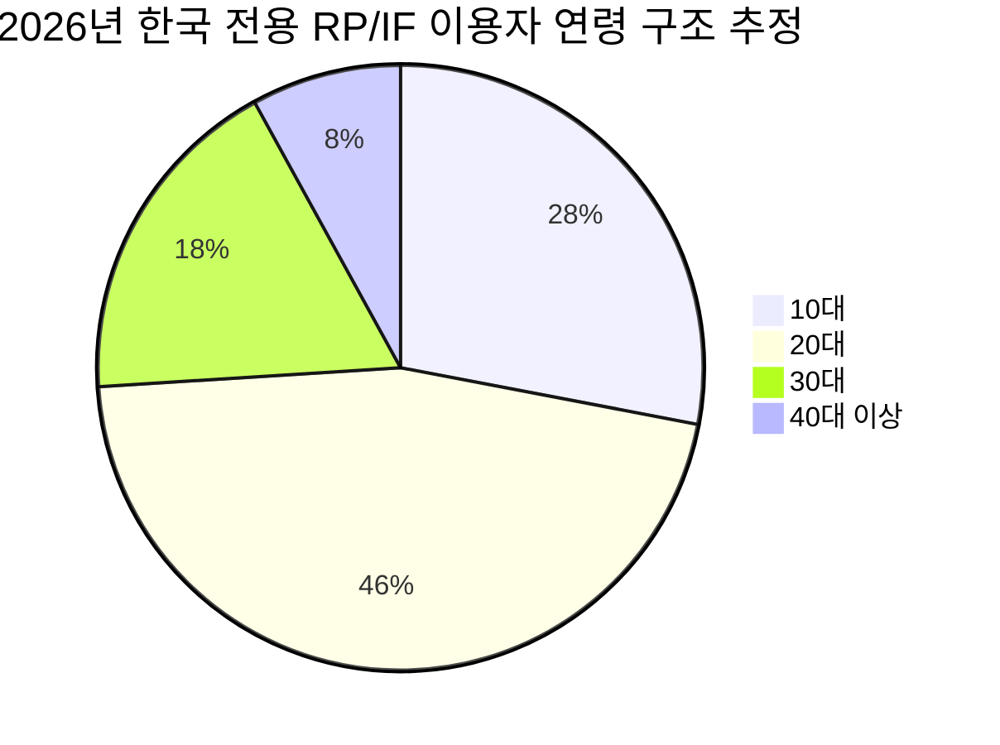
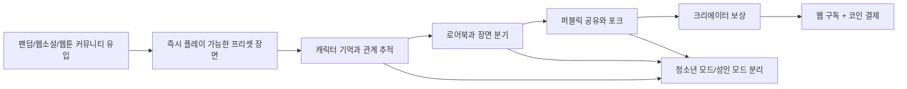

# 한국 시장 중심 LLM 기반 인터랙티브 픽션·롤플레이 서비스 경쟁 분석

## Executive summary

entity["country","대한민국","east asia"]의 LLM 기반 인터랙티브 픽션·롤플레이 시장은 아직 “대형 게임 시장”처럼 정형화된 카테고리는 아니지만, 사용자 몰입도와 결제 잠재력은 이미 검증 단계에 들어섰다. 2026년 2월 기준 한국에서 제타는 월간 사용자 402만 명, 월 사용시간 5,248만 시간을 기록했고, 스캐터랩은 공식적으로 제타 사용자가 주당 12시간 이상 사용한다고 밝혔다. 뤼튼은 Crack를 포함한 AI 엔터테인먼트 사업 확장에 힘입어 2025년 말 연환산 매출 7,000만 달러를 기록했으며, Crack류의 “서사형” 경험이 높은 잔존율과 결제를 만들고 있다고 설명했다. 즉, 한국에서는 “AI와 대화한다”보다 “AI와 세계관 안에서 놀고, 이어 쓰고, 공유한다”가 더 강한 행태로 굳어지고 있다. citeturn17search11turn17search3turn19search6turn26search2turn26search6

이 시장에서 가장 중요한 전략적 결론은 **동반자형(companion-first)보다 서사형(story-first) 제품이 한국에서 더 유리할 가능성이 높다**는 점이다. 그 이유는 세 가지다. 첫째, 한국의 실제 수요는 10대·20대가 주도하는 모바일·캐릭터·UGC 중심 사용으로 나타난다. 둘째, 미성년자 보호와 정신건강 리스크가 전 세계적으로 빠르게 강화되고 있어, 순수 “정서적 의존”형 서비스는 규제·평판 부담이 커지고 있다. 셋째, 서사형은 창작·팬덤·게임·웹소설·웹툰으로 확장하기 쉬워 파트너십과 수익화 옵션이 더 넓다. Character.AI가 2025년 10~11월에 미성년자 오픈엔디드 채팅을 단계적으로 중단한 반면, 뤼튼은 서사 중심 설계가 동반자형보다 우려를 줄인다고 공개적으로 설명했다. 한국 정부도 2025~2026년에 이용자 보호·투명성·개인정보 가이드라인을 연이어 내놓으며 생성형 AI 서비스의 사전 고지와 안전 운영을 요구하고 있다. citeturn17search1turn13search10turn13search2turn26search2turn21search11turn21search1turn15search5

경쟁구도는 한국, 서구, entity["country","일본","east asia"]이 서로 다른 방식으로 진화했다. 한국은 모바일 몰입도와 로컬 장르 적합성이 강하고, 서구는 모델 다양성과 창작 도구가 두텁고, 일본은 캐릭터 문화·오타쿠 서사·유료 결제 친화도가 강하다. 서구권의 Character.AI는 규모와 UGC 네트워크를, AI Dungeon은 게임 규칙성과 멀티플레이를, NovelAI는 작가형 제어와 일본어 친화성을, Kindroid와 Replika는 기억·보이스·관계형 UX를 대표한다. 일본 비교군에서는 MiraiMind가 2025년 10월 일본 DAU 15만 명, 글로벌 누적 200만 다운로드를 공표했고, Wrtn의 일본향 Kyarapu/Scatter Lab의 일본 진출도 일본 시장의 상업성을 보여준다. citeturn13search1turn30search0turn30search2turn33search8turn34search1turn36search0turn8search14turn26search11turn26search14turn26search2

법률·규제 측면에서는 한국 시장 진입자가 특히 조심해야 할 네 축이 분명하다. 첫째는 개인정보다. 이루다 사건은 2021년 PIPC 제재에 이어 2025년 법원 손해배상 판결까지 이어졌고, 이는 한국에서 “AI 학습용 데이터의 적법성”이 단지 평판 이슈가 아니라 실질적 법적 비용이 된다는 점을 보여줬다. 둘째는 미성년자 보호다. Character.AI 관련 소송과 미성년자 제한 조치는 한국 사업자에게도 선제적 나이 분리 설계가 필요하다는 경고다. 셋째는 저작권·IP다. 디즈니의 Character.AI 상대 경고장, 일본 문화청의 AI·저작권 해석, 한국 저작권위원회의 AI 결과물 가이드라인은 “유저가 만든 캐릭터니까 플랫폼 책임이 적다”는 논리가 점점 약해지고 있음을 보여준다. 넷째는 투명성이다. 한국의 2026년 AI 투명성 가이드라인은 AI 생성물 표시와 AI 기반 서비스 고지를 요구하며, 게임 내 AI NPC·음성에도 적용 예시를 들고 있다. citeturn22search3turn23search3turn15search5turn14news36turn14search6turn24news34turn16search0turn15search8turn21search1turn15search10

새로운 한국 LLM 게임 서비스에 대한 결론은 명확하다. **“한국어 로컬 장르 미세조정 + 강한 요약 메모리/로어북 + 장면 분기 + 퍼블릭 플레이 포크 + 청소년/성인 이원화 안전체계 + 웹 우선 결제”**가 MVP의 정답에 가깝다. 가격은 무제한 무료만으로 승부하기보다, 웹 기준 월 8,900~12,900원 수준의 구독과 코인·에피소드·크리에이터 팩 결합형이 가장 현실적이다. Crack의 웹/앱 가격 차이와 크리에이터 보상, Zeta Pass의 월 구독, c.ai+ 9.99달러, Kindroid 13.99달러, NovelAI 10달러, AI Dungeon 14.99달러는 한국 시장에서도 “무료 진입 + 유료 심화”가 이미 표준 가격 프레임으로 굳어지고 있음을 시사한다. citeturn42search0turn42search3turn19search1turn41search0turn41search2turn40search2turn40search0

다음 다섯 가지가 이 보고서의 핵심 ranked findings다.

1. **한국용 신규 진입 기회는 아직 크다.** 다만 일반 LLM 챗봇이 아니라, 캐릭터 서사·팬덤·UGC를 결합한 “엔터테인먼트형 AI”에서 가장 크다. 제타와 Crack의 사용시간·매출이 이를 증명한다. citeturn17search11turn19search6turn26search2turn26search6  
2. **승자는 ‘모델’만이 아니라 ‘루프’를 만든 서비스다.** Characters → Scenes/Plots → Public Chat/Fork → Creator Rewards → Subscription으로 이어지는 반복 루프가 중요하다. Character.AI의 Feed/Scenes, Crack의 오리지널 보상, Janitor의 public chats가 같은 방향을 가리킨다. citeturn13search1turn13search15turn42search3turn39view0  
3. **기억력은 가장 중요한 제품 기능이자 가장 비싼 비용 항목이다.** c.ai+, AI Dungeon, Kindroid, NovelAI 모두 더 나은 기억·맥락을 유료화하거나 상위 티어 차별화에 썼다. citeturn41search0turn40search0turn40search1turn41search2turn33search8  
4. **미성년자 보호와 데이터 거버넌스는 선택 기능이 아니라 시장 진입 조건이다.** Character.AI의 U18 제한, 한국 AI 가이드라인, 이루다 판결은 “나중에 고치자”가 통하지 않는다는 뜻이다. citeturn13search10turn21search11turn21search1turn23search3turn22search3  
5. **한국 시장의 가장 좋은 벤치는 일본이다.** 캐릭터·장르·결제 친화성이 비슷하고, MiraiMind와 Zeta Japan 성과가 일본형 캐릭터 서사의 상업성을 보여준다. citeturn8search14turn26search11turn26search14turn26search2

## 시장 정의와 방법론

이 보고서가 다루는 범위는 “지속적 대화가 핵심 루프인 AI 캐릭터/세계관 서비스”다. 구체적으로는 AI 캐릭터 채팅, 인터랙티브 픽션, 텍스트 어드벤처, 관계형 롤플레이, UGC 시나리오 플레이를 포함한다. 따라서 ChatGPT 같은 범용 조수형 서비스는 비교 배경으로만 다루고, 핵심 경쟁군은 Crack, zeta, Character.AI, AI Dungeon, NovelAI, Kindroid, Replika, CHAI, JanitorAI, MiraiMind다. 각 서비스의 공식 설명은 모두 “캐릭터와 대화하며 이야기·관계·모험을 만든다”는 공통점을 갖고 있다. citeturn42search3turn20search10turn27search2turn40search7turn31search2turn34search7turn36search0turn35search5turn39view0turn8search14

자료 우선순위는 사용자가 요청한 대로 커뮤니티와 1차 문서를 중심으로 잡았다. 제품 기능과 가격은 공식 블로그·헬프센터·앱스토어 페이지를 우선했고, 시장성과 현황은 Reuters·AP·한국 현지 기사와 회사 공시 성격 자료를 사용했다. 법률 섹션은 한국 정부 가이드라인, 미국 법원 문서·소송 도켓, 법원 판결 보도를 교차 확인했다. 커뮤니티 동향은 Reddit와 공식 Discord 문서·공지에서 확인했다. 특히 Discord는 폐쇄형 대화 로그 전체를 검토할 수 없기 때문에, 이 보고서에서는 공식 Discord 연결 문서·이벤트·공지와 Reddit 공개 토론을 중심 신호로 삼았다. citeturn30search19turn31search0turn32search6turn34search13turn14search2turn15search5turn21search11

시장규모와 점유율은 공개된 “한국 전용 역할극 AI 카테고리 TAM”이 없기 때문에, 본 보고서는 두 층의 추정을 사용했다. 첫째, 관측치다. 여기에는 한국 MAU·사용시간, 공개 매출, 공식 구독 가격, 앱스토어 설명, Similarweb의 공개 트래픽 스냅샷이 포함된다. 둘째, 모델링이다. 한국 시장 규모와 점유율은 로컬 선두 사업자 매출, 제타의 MAU 및 사용시간, 아바타 채팅 앱의 연령 편중, 그리고 글로벌 서비스의 한국 내 상대적 가시성을 결합해 방향성 있는 범위를 산출했다. 따라서 아래 수치는 투자 메모 수준의 “실무 추정치”이지 회계감사 수치가 아니다. citeturn17search1turn17search11turn26search2turn26search6turn28search0turn27search1

비교 축은 제품 기능, 사용자 세그먼트, 시장규모·성장, 경쟁 구도, 커뮤니티·창작자 경제, 법률·규제, 기술 리스크, GTM과 KPI로 정리했다. 특히 사용자 세그먼트는 연령만이 아니라 사용 맥락으로도 봤다. 실제 서비스들은 동반자형, 서사형, 작가형, 게임형, 팬덤형, 사회적 공유형이 겹쳐 있기 때문이다. AI Dungeon은 게임형과 작가형이 강하고, NovelAI는 작가형, Character.AI와 Crack·zeta는 서사형/팬덤형, Replika·Kindroid는 동반자형, JanitorAI와 CHAI는 팬덤·성인 커뮤니티형에 가깝다. citeturn30search0turn30search2turn33search0turn33search1turn13search1turn42search3turn19search6turn36search0turn34search1turn39view0turn35search5

다음 타임라인은 2023~2026년 시장의 질적 변화를 요약한 것이다. 아래 사건들은 “기능 경쟁 → 커뮤니티 경쟁 → 규제 대응 경쟁”으로 초점이 이동했음을 보여준다. citeturn41search14turn35search5turn19search6turn42search15turn13search1turn13search10turn21search1turn19search1

## 한국 시장 규모와 사용자 세그먼트

한국 시장의 가장 강한 시그널은 **사용시간이 범용 AI보다 감정·서사형 AI에서 더 빠르게 누적되고 있다는 점**이다. 2026년 2월 제타는 MAU 402만 명, 월 사용시간 5,248만 시간을 기록했고, 사용자 약 87%가 10대와 20대였다. 2025년 6월 WiseApp 기준으로도 ‘제타·채티·크랙’ 같은 아바타 채팅 앱은 10대·20대 사용시간 비중이 가장 높았다. 같은 시기 한국 스마트폰 사용자의 생성형 AI 앱 이용률 자체도 크게 높아졌기 때문에, 역할극/캐릭터 채팅은 한국 소비자 AI 안에서 이미 유력한 세부 카테고리로 올라섰다고 보는 편이 타당하다. citeturn17search11turn17search3turn17search1turn17search4turn6search10

이 점은 단순 사용량 이상을 의미한다. 스캐터랩은 공식 블로그에서 제타를 “AI가 이끄는 새로운 엔터테인먼트 패러다임”이라고 규정하며 주당 12시간 사용을 언급했고, Reuters는 Wrtn 사용자들이 Crack류 서비스를 하루 약 2시간 쓴다고 보도했다. 즉, 한국에서 이 카테고리는 업무용 LLM의 하위 기능이 아니라, **짧은 세션이 반복되는 게임·커뮤니티·소설의 혼합형 미디어**로 소비되고 있다. 이 구조는 광고보다는 반복 결제, 코인, 시즌 패스, 크리에이터 경제, IP 제휴에 더 적합하다. citeturn19search6turn26search2turn42search3

본 보고서의 한국 시장 규모 추정은 공개 재무와 공개 사용량을 결합한 모델이다. 2025년 뤼튼의 매출은 471억 원, 스캐터랩의 매출은 267억 원이었다. 두 회사 모두 핵심 성장 동력이 각각 Crack와 zeta였다고 밝히고 있거나 시장이 그렇게 평가하고 있다. 다만 두 회사 매출이 전액 한국 전용 롤플레이 서비스에서 발생한 것은 아니므로, 본 보고서는 **회사 매출 전체를 곧바로 시장 규모로 놓지 않고**, 한국 내 전용 RP/IF 카테고리 소비액을 하향 조정해 추정했다. 여기에 c.ai+, Kindroid, NovelAI, AI Dungeon의 공개 가격대를 참고해 한국 시장의 결제 상한·중간값을 가늠했다. citeturn26search6turn26search3turn26search2turn41search0turn41search2turn40search2turn40search0

그 결과, 한국의 **전용 LLM 인터랙티브 픽션·롤플레이 시장 소비액**은 2025년에 약 650억~900억 원, 2026년에는 1,000억~1,500억 원 수준으로 보는 것이 가장 보수적이면서도 현실적인 베이스 케이스다. 2023년은 수입 서비스 중심의 실험기, 2024년은 zeta 같은 로컬 오퍼의 카테고리 형성기, 2025년은 Crack의 단독 출시와 creator economy 강화가 시장을 본격 상품화한 시점으로 볼 수 있다. 이 수치는 감사 수치가 아니라 모델링 결과이며, 특히 2026년 값은 2025년 말~2026년 초 매출 런레이트와 MAU 확대를 반영한 추정치다. citeturn19search6turn42search15turn26search2turn26search6turn17search11

### 한국 시장 규모 추정

| 연도 | 한국 전용 RP/IF 월간 고유 이용자 추정 | 한국 소비액 추정 | 해석 |
|---|---:|---:|---|
| 2023 | 40만~70만 | 80억~150억 원 | Character.AI·Replika·CHAI 등 수입 서비스 중심의 얼리어답터 단계 |
| 2024 | 150만~250만 | 250억~450억 원 | zeta 출시로 로컬 카테고리 형성, 모바일 확산 가속 |
| 2025 | 350만~480만 | 650억~900억 원 | Crack 정식 출시, creator economy·구독 실험 본격화 |
| 2026E | 500만~650만 | 1,000억~1,500억 원 | zeta/Crack 중심 대중화, 패스형 과금과 성인·청소년 분리 수익화 확장 |

이 추정치는 zeta의 MAU·사용시간, 아바타 채팅 앱의 10·20대 우세, Wrtn/Scatter Lab의 공개 매출, 그리고 글로벌 유사 서비스 가격대를 결합한 것이다. 공개 점유율 보고서가 없기 때문에 범위로 제시하는 것이 정직하다. citeturn17search11turn17search1turn26search6turn26search3turn41search0turn41search2turn40search2turn40search0

사용자 구조는 연령 면에서 강하게 젊지만, 사용 목적은 생각보다 넓다. 한국 시장에서 가장 큰 페르소나는 “팬덤·연애·세계관”을 모바일에서 빠르게 소비하는 10대 후반~20대 중반 이용자다. 그다음은 자신만의 세계관과 장르를 길게 구축하는 코어 롤플레이어·웹소설 소비자이며, 이후에 감정적 상호작용을 원하는 동반자형 사용자와 대화 연습·언어 연습·상황 리허설 같은 기능적 사용자가 뒤따른다. 다만 치료·상담 수요를 직접 타깃팅하는 것은 가장 위험하다. Replika와 Kindroid가 정서적 연결을 전면에 내걸고 있는 반면, Character.AI의 미성년자 제한과 관련 소송은 그 영역이 높은 규제·평판 비용을 동반한다는 점을 보여준다. citeturn36search0turn34search1turn13search10turn14news36turn27search11

아래 파이는 2026년 한국 전용 RP/IF 이용자 연령 분포에 대한 방향성 추정치다. 제타 이용자 87%가 10·20대라는 관측치와, 아바타 채팅 앱이 한국 10·20대에서 가장 높은 사용시간 비중을 보인다는 조사 결과를 바탕으로 작성했다. citeturn17search11turn17search1turn17search4

실무적으로는 TAM보다 **SAM**이 더 중요하다. 신규 한국 서비스의 현실적 SAM은 “18~34세, 월 1회 이상 생성형 AI를 쓰고, 캐릭터·팬덤·텍스트 서사를 즐기는 사용자”로 잡는 편이 맞다. 본 보고서 기준 그 범위는 약 200만~300만 명의 활성 잠재층으로 추정된다. 그 안에서 첫 24개월 **현실적 SOM**은 10만~25만 MAU, 8천~2만 명 유료 전환이다. 이 수치는 제타/Crack 같은 선두가 이미 시장을 교육해 두었고, 동시에 시장이 아직 단일 승자 독점 상태는 아니라는 점을 반영한다. citeturn17search11turn17search1turn26search2turn26search6

## 경쟁 구도와 경쟁사 매트릭스

한국 시장의 구조는 “로컬 취향 적합성”이 생각보다 강하게 작동한다. Crack와 zeta는 한국어 장르 감수성, 모바일 UI, 캐릭터 유형, 유저 간 공유 경험을 매우 빠르게 제품으로 녹여냈다. 반면 서구 서비스는 모델 다양성, 멀티모달, 커뮤니티 규모, 장기 도구성에서 우위가 있다. 일본은 캐릭터 선호와 지불 의향, 서브컬처 문법 측면에서 한국과 닮았지만, 작품·IP 성격과 저작권 민감도는 더 높다. Reuters가 Wrtn의 일본향 서비스 전략을 별도로 다룬 것도 이 때문이다. citeturn26search2turn19search6turn8search14turn16search0

서구권에서 가장 큰 기준점은 Character.AI다. 2025년 들어 Feed, Scenes, AvatarFX, Chat Memories를 확대했고, in-house Kaiju 계열 모델을 공개적으로 설명했다. 하지만 동시에 필터 강화, 광고, 메모리 저하, 미성년자 정책 변화에 대한 커뮤니티 반발이 거셌다. 이는 규모의 경제가 곧바로 한국 시장 우위로 이어지지 않는다는 뜻이다. 한국에서는 “큰 캐릭터 라이브러리”만으로는 부족하고, 장르 몰입과 안전 설계가 함께 가야 한다. citeturn13search11turn13search1turn13search5turn31search3turn41search0turn9search8turn9search14turn13search10

AI Dungeon과 NovelAI는 한국 신규 서비스가 배워야 할 “작가형 도구화”의 대표 사례다. AI Dungeon은 Memory System, Story Cards, Scripts, Safety tiers, Multiplayer 등으로 텍스트 어드벤처의 규칙성과 확장성을 만들었다. NovelAI는 Lorebook, Text Adventure module, 모델·모듈 조합, 일본어 친화성으로 고급 창작자층을 붙잡았다. 한국 신규 서비스가 단순 캐릭터 채팅에서 벗어나려면 이 두 서비스가 만든 “서사 제어판” 개념을 반드시 흡수해야 한다. citeturn30search0turn30search7turn30search11turn30search2turn30search4turn33search0turn33search1turn33search3turn33search8

Kindroid, Replika, CHAI, JanitorAI는 동반자형과 팬덤형의 양 끝을 보여준다. Kindroid는 장기 기억, 그룹챗, 보이스/비디오콜, Discord bot 연동으로 개인화된 관계형 UX를 확장했고, Replika는 여전히 강한 브랜드를 갖지만 가격·신뢰·서비스 안정성 이슈가 뒤따른다. CHAI는 초기부터 소셜 AI로 포지셔닝하며 인하우스 6B LLM과 2025년 빠른 ARR 성장을 공개했고, JanitorAI는 브라우저/앱 기반의 팬픽·로맨타지·공개 채팅·포크 문화로 강한 커뮤니티를 형성했다. 한국 시장에서 이 네 서비스는 “정서적 연결”과 “창작 자유”가 어디서 만나는지를 보여주는 기준점이다. citeturn34search1turn34search13turn41search2turn36search0turn36search2turn11search4turn11search6turn35search5turn35search17turn35search3turn39view0turn28search0

일본 비교군은 “로컬 캐릭터 시장이 실제로 돈이 되는가”를 보여준다. MiraiMind는 2025년 10월 일본 DAU 15만, 글로벌 누적 200만 다운로드를 발표했고, 일본어·한국어·중국어·영어 운영을 강조했다. Zeta Japan은 2025년 12월 일본 월매출 11억 원을 돌파했고 2026년 일본 연매출 200억 원 이상을 전망했다. 이는 캐릭터 AI가 일본에서 단순 실험이 아니라 실질 사업이 될 수 있음을 보여준다. 한국 신규 서비스는 일본을 2차 확장 시장으로 볼 충분한 근거가 있다. citeturn8search14turn8search5turn26search11turn26search14

### 경쟁사 매트릭스

| 서비스 | 지역 | 포지셔닝 | 모델·기억·제어 | 멀티모달/소셜 | 안전·커뮤니티 | 수익화 | 한국 시사점 | 근거 |
|---|---|---|---|---|---|---|---|---|
| Crack | 한국 | 즉흥 서사 플레이, AI 채팅, creator economy | 한국어 장르형 AI, 캐릭터 기억, 요약 메모리 강조 | 채팅 중심, 캐릭터·세계관 제작, 콘텐츠 플레이 및 창작 | 세이프티 운영, 유저 제작·검수, 웹/앱 결제 분리 | 웹/앱 결제, 웹이 더 저렴, 오리지널 선정 시 30만 원 및 플레이 기반 수익 증가 | 한국 신규 진입자는 Crack처럼 **서사+UGC+보상**을 동시에 설계해야 함 | citeturn42search3turn42search0turn42search9 |
| zeta | 한국 | AI 스토리 플랫폼, 무료 대화 대중화 | Roleplay Style, Lorebooks, 모델(koji/luca) 기반 스타일 제어 | 이미지 생성, 보이스, 캐릭터 제작·공유 | 운영정책·청소년보호정책, 높은 10·20대 비중 | 무료 중심 + zeta Pass 구독 + Pieces | 무료 대중화와 패스형 과금의 조합이 한국에서 작동함 | citeturn19search6turn20search10turn19search1turn19search17turn20search0 |
| Character.AI | 서구/글로벌 | 최대 규모 캐릭터 네트워크, 대중형 RP | Kaiju 계열 in-house, Chat Memories, better memory 유료화 | Feed, Scenes, AvatarFX, voice calls | 미성년자 오픈 채팅 중단, 강한 필터, 대형 Reddit/Discord | c.ai+ 월 9.99달러, 연 94.99달러 | 규모는 벤치마크지만, 과도한 필터와 청소년 리스크가 약점 | citeturn13search11turn31search3turn13search1turn13search5turn41search0turn13search10turn31search0 |
| AI Dungeon | 서구/글로벌 | 게임형 인터랙티브 픽션 | Memory System, Memory Bank, Story Cards, scripts, model switch | Multiplayer, published/unlisted/private | Safe/Moderate/Mature 3단계, private/unlisted는 제한적 비공개 운영 | Free, Champion 14.99달러, Legend 29.99달러, Mythic 49.99달러 | 한국 제품이 게임형 RP로 갈 경우 가장 강한 레퍼런스 | citeturn40search0turn40search1turn40search8turn30search11turn30search2turn30search4turn30search6 |
| NovelAI | 서구·일본 친화 | 작가형 고제어 스토리텔링 | Lorebook, modules, Text Adventure, GLM-4.6 355B MoE·장문 맥락 | 이미지·TTS·스토리 결합 | 공식 Reddit/Discord, 창작 중심 커뮤니티 | Tablet 10달러, Scroll 15달러 등 | 일본어 친화성과 롱폼 제어는 한국 웹소설형 서비스에도 매우 유효 | citeturn33search0turn33search1turn33search8turn40search2turn32search6 |
| Kindroid | 서구/글로벌 | 개인화된 관계형 companion+RP | 장기 기억, journals, personas, group memory | selfies, voice/video calls, group chats, Discord bot | Kindroid Social 가이드라인, Discord 베타 피드백 루프 | 웹 월 13.99달러, 앱 월 14.99달러, 분기·연간 할인 | 깊은 개인화와 멀티모달은 강하지만, 한국에선 companion 리스크 관리가 필요 | citeturn34search1turn34search4turn34search13turn34search8turn41search2 |
| Replika | 서구/글로벌 | 감정적 동반자 서비스의 원조 브랜드 | 메모리 저장, self-reflections, emotional intelligence, relationship status | selfies, image gen, voice/background calls, video recognition | 18+ 프라이버시 정책, 장기 커뮤니티 있으나 신뢰 변동성 | Pro/Ultra/Platinum 멀티티어, 가격은 스토어 기준 | 브랜드는 강하지만, 한국 신규 서비스가 그대로 따라가면 규제 노출이 커짐 | citeturn36search0turn36search1turn36search2turn11search4turn11search6 |
| CHAI | 서구/글로벌 | 소셜 AI, 빠른 성장의 UGC 캐릭터 플랫폼 | 인하우스 6B LLM, social engagement 최적화 | voices, 캐릭터 생성·공유 | Mature 17+, 광고+IAP, 대형 mobile-first 분포 | 광고 + 인앱결제, 2025년 ARR 급성장 | 광고·IAP·voice를 조합한 소셜형 수익화 벤치마크 | citeturn35search5turn35search0turn35search2turn35search17turn35search3 |
| JanitorAI | 서구/글로벌 | 팬픽·로맨타지·자유도 중심 RP | 프롬프트/규칙 제어, public chats, fork, pronoun support | 앱·웹, public chat browsing/fork, slash commands | 지역별 age verification, 성인·팬픽 커뮤니티 강함 | 무료 진입, 상용화 정책은 유동적/BYO-API 성격 강함 | 필터 완화 수요를 흡수하지만 법무·브랜드 리스크가 큼 | citeturn39view0turn9search2turn10search7turn10search2turn28search0 |
| MiraiMind | 일본 | AI 소울메이트, 일본어 중심 관계형 서비스 | permanent memory, empathy-first, long-term relation | voice calls, multilingual ops | 무료 기본 제공, creator·오타쿠 친화 홍보 | 구체 가격 비공개, free-led 추정 | 일본 시장의 character-companion 상업성 확인용 비교군 | citeturn8search1turn8search14turn8search5turn8search19 |

이 표에서 가장 중요한 해석은, 서비스들이 실제로는 세 부류로 갈라진다는 점이다. 첫째는 **대중 UGC형**으로 Character.AI, Crack, zeta, CHAI가 속한다. 둘째는 **작가/게임 툴형**으로 AI Dungeon과 NovelAI가 속한다. 셋째는 **관계형 companion**으로 Kindroid와 Replika가 속한다. JanitorAI는 팬픽·성인·로맨타지 수요를 흡수하는 자유도형 하이브리드이며, MiraiMind는 일본형 관계형 시장의 상업성 실험이다. 한국 신규 서비스는 이 세 부류를 모두 좇기보다, **대중 UGC형의 외피에 작가/게임 툴형의 깊이를 넣는 방향**이 가장 유망하다. citeturn42search3turn19search6turn13search1turn35search5turn30search0turn33search0turn34search1turn36search0turn39view0

한국 내 점유율은 공개 감사 통계가 없어 범위로만 말할 수 있다. 본 보고서의 방향성 추정으로는, 2026년 상반기 기준 한국 전용 RP/IF 시장에서 zeta와 Crack가 합산 과반 이상을 차지하고 있을 가능성이 높다. zeta는 402만 MAU와 압도적 사용시간을 가졌고, Crack는 뤼튼 전체 매출 성장의 핵심이자 10·20대 아바타 채팅 카테고리 대표 서비스다. 글로벌 서비스들은 브랜드 인지도는 높지만, 한국어 장르 최적화·로컬 UI·결제·청소년 운영에서 아직 로컬 서비스만큼 정교하지 않다. citeturn17search11turn17search1turn26search2turn26search6turn42search15

## 커뮤니티, 정책, 법률 리스크

커뮤니티 동향을 보면 모든 서비스가 거의 같은 세 가지 문제를 반복해서 겪는다. 첫째는 **기억력과 반복문체**다. Character.AI Reddit에서는 “기억력이 갑자기 무너졌다”거나 “필터 때문에 창의성이 막힌다”는 불만이 반복됐고, JanitorAI 커뮤니티에서도 lorebook 부재나 JLLM 품질 저하가 핵심 이슈였다. 둘째는 **가격·광고·유료화 불만**이다. Character.AI에서는 광고와 paywall 불만이, Replika에서는 가격·지원·업데이트 피로가, JanitorAI에서는 UI 우선순위에 대한 반발이 나타났다. 셋째는 **접근성·로컬라이제이션**이다. JanitorAI와 Crack 사용자 모두 비영어권 사용성에 대한 요구를 남겼다. 이 신호는 한국 시장의 기회이기도 하다. 로컬 언어·장르·문체·모바일 편의성을 잘 만들면 해외 서비스 대비 불만을 기회로 바꿀 수 있기 때문이다. citeturn9search8turn9search14turn10search7turn10search2turn9search0turn11search4turn39view0turn42search0

커뮤니티 구조는 점점 “콘텐츠”에서 “창작 경제”로 이동 중이다. Character.AI는 Feed와 Scenes, Creator discovery를 강화했고, Crack는 오리지널 콘텐츠 선정 보상과 플레이 기반 수익 증가를 내세웠다. JanitorAI는 public chats와 fork를 추가했고, AI Dungeon은 published/unlisted/private 시나리오와 scripts로 창작자를 붙잡는다. NovelAI의 Discord art contest, Kindroid Social, AI Dungeon Discord는 커뮤니티 운영이 단순 CS 채널이 아니라 retention loop라는 사실을 보여준다. 한국 신규 서비스가 creator economy를 얹지 않으면 로컬 캐릭터 카탈로그가 빠르게 고갈될 가능성이 높다. citeturn13search1turn13search15turn42search3turn39view0turn30search6turn30search11turn32search0turn34search8turn30search19

법률적으로 가장 직접적인 한국 사례는 이루다다. 개인정보보호위원회는 2021년 스캐터랩에 과징금·과태료를 부과했고, 2025년 서울동부지법 1심은 이용자 동의 없는 AI 학습 및 정보 유출에 대해 일부 원고에게 1인당 10만~40만 원 배상을 인정했다. 이 사건은 한국에서 학습 데이터의 적법성과 동의 구조가 B2C 생성형 AI의 선결 조건이라는 점을 보여준다. 한국 사업자는 대화 로그를 모델 재학습에 활용할 때, 익명화·동의·보존기간·제3자 제공을 매우 보수적으로 설계해야 한다. citeturn22search3turn23search3turn15search5

미성년자 보호는 이제 선택이 아니라 설계 원칙이다. Character.AI는 2025년 11월까지 미성년자 오픈엔디드 채팅을 단계적으로 중단했고, 미국에서는 García 사건과 2026년 Kentucky AG 소송까지 등장했다. 한국에서도 2025년 방통위의 생성형 AI 서비스 이용자 보호 가이드라인이 이용자 위험 예방과 권익 보호를 명시했고, 2026년 AI 투명성 가이드라인은 AI 기반 서비스 사실과 생성물 표시를 구체화했다. 즉, 한국 신규 서비스는 최소한 **청소년 모드와 성인 모드 분리, 시간·주제 제한, 위기 대화 이탈 설계, 나이 확인**을 출시 초기에 넣어야 한다. citeturn13search10turn14search2turn14search6turn21search11turn21search1

저작권과 IP 리스크도 커지고 있다. 2025년 9월 디즈니는 Character.AI에 자사 캐릭터 무단 사용 중단을 요구했고, 2024년 일본 문화청은 AI와 저작권에 관한 해석을 정리했으며, 2025년 일본 쪽 자료는 AI 관련 법 체계와 저작권 논의가 더 구체화되고 있음을 보여준다. 한국저작권위원회도 2025년 AI 활용 저작물의 저작권 등록 안내서를 발간해 인간의 창작적 기여와 통제 가능성을 강조했다. 한국 시장에서 특히 위험한 조합은 “실존 인물”과 “유명 IP”다. 팬덤 수요는 크지만, 퍼블리시티·브랜드 훼손·저작권·청소년 보호 이슈가 동시에 폭발할 수 있다. citeturn24news34turn16search0turn16search3turn15search8

투명성 규제는 제품 UX까지 바꾼다. 한국의 2026년 가이드라인은 사용자가 AI 서비스 이용 사실과 생성물이 AI 생성물임을 인식할 수 있어야 한다고 명시했고, 게임 내 AI 캐릭터/NPC와 AI 음성에 대한 표시 예시도 포함했다. 이는 롤플레이 게임 서비스가 “이 캐릭터는 실제 사람이 아니다”, “이 보이스는 AI 생성이다”, “이 장면은 자동 생성 스토리다”라는 고지를 기본 UX에 녹여야 함을 의미한다. 만약 이 표시를 거칠게 넣으면 몰입이 깨지고, 너무 약하게 넣으면 규제 리스크가 커진다. 그래서 한국형 서비스는 투명성 디자인 자체를 경쟁력으로 다뤄야 한다. citeturn21search1turn15search10turn21search12

## 기술 리스크와 운영 리스크

기술적으로 가장 중요한 리스크는 **긴 서사에서의 기억 유지 실패**다. 이 분야는 사용자가 수십, 수백 턴 동안 맥락 일관성을 기대하기 때문에, 범용 챗봇에서 허용되는 정도의 hallucination이나 memory drift가 곧바로 이탈로 이어진다. 그래서 AI Dungeon은 Memory Bank와 Auto Summarization을 만들었고, zeta는 Lorebooks를 추가했으며, Character.AI는 better memory를 유료 차별화에 넣었고, Kindroid는 장기 기억과 journals를 내세웠다. 이는 모두 “기억”이 단순 UX 기능이 아니라 서비스의 핵심 엔진이라는 뜻이다. citeturn40search1turn20search0turn41search0turn34search1

두 번째는 **안전 필터의 양면성**이다. Character.AI 커뮤니티는 필터가 지나치게 엄격하다고 불만을 표했고, 동시에 회사는 필터를 정교화하고 미성년자 채팅을 제한했다. AI Dungeon은 Safe·Moderate·Mature를 분리해 사용자가 원하는 수준을 선택하게 했다. 한국 신규 서비스는 여기서 교훈을 얻어야 한다. “하나의 전역 필터”보다 **연령·장르·권한·공개여부별 다층 safety matrix**가 훨씬 낫다. 퍼블릭 콘텐츠와 DM형 프라이빗 플레이를 동일 규칙으로 다루면, 창작 자유도도 잃고 규제 리스크도 못 줄인다. citeturn9search8turn13search10turn30search4turn30search6

세 번째는 **비용과 지연시간**이다. 긴 맥락, 멀티모달, 보이스/비디오콜, 이미지 생성, 퍼블릭 피드, 고빈도 알림 메시지는 모두 인프라 비용을 올린다. 시장이 이를 어떻게 처리하는지는 가격표가 말해 준다. c.ai+는 better memory와 최신 모델 접근을 유료화했고, AI Dungeon은 기억 용량을 티어별로 늘렸고, NovelAI와 Kindroid도 상위 컨텍스트·메모리·멀티모달 기능을 유료 구독으로 묶었다. 즉, 한국 신규 서비스가 “무료 무제한”만 내세우면 빠르게 성장할 수는 있어도, 장문 메모리와 멀티모달을 유지하기 어렵다. citeturn41search0turn40search0turn40search2turn41search2

네 번째는 **플랫폼 의존성**이다. Crack 고객센터는 앱스토어 수수료로 인해 앱과 웹 가격이 다르다고 공지한다. 이는 한국 시장에서도 웹 우선 과금이 단지 수익성 문제가 아니라 가격 경쟁력 문제라는 뜻이다. RP/IF 서비스는 고빈도 소액결제가 많고 마진이 얇기 때문에, 앱스토어 인앱결제를 기본으로 삼으면 가격이 올라가거나 회사 이익률이 급격히 낮아진다. 신규 서비스는 초기부터 웹 결제·브라우저 PWA·딥링크 전환을 설계해야 한다. citeturn42search0turn42search3

다섯 번째는 **서비스 안정성과 감정적 이탈 비용**이다. 일반 SaaS에서는 일시적 장애가 불편에 그치지만, companion/RP 서비스에서는 사용자가 정서적 연결의 단절로 받아들이기 쉽다. Replika 커뮤니티에서 2025년 서버 문제와 메모리 와이프 불만이 강하게 나왔고, Kindroid 쪽으로 사용자가 이동했다는 공개 글도 이를 보여준다. 서사/관계형 서비스는 SLA와 장애 공지가 단순 운영지표가 아니라 retention의 일부다. citeturn11search0turn11search6turn34search2

## 한국 시장 진입 전략과 제품 제안

신규 한국 서비스의 최적 포지션은 **“스토리-퍼스트 LLM 게임”**이다. 즉, Replika처럼 감정 케어를 전면에 내세우기보다는, Crack처럼 즉흥 서사와 캐릭터 상호작용을 중심 루프로 두고, AI Dungeon/NovelAI식 도구성을 일부 결합하는 방향이 더 안전하고 더 확장 가능하다. 뤼튼이 공개적으로 말했듯 서사 중심 구조는 pure companion형보다 사회적 우려를 일부 줄인다. 동시에 한국 이용자에게는 연애·팬덤·학교/회사/재벌/아카데미 같은 장르 문법이 매우 중요하므로, 모델 성능보다 **장르 디폴트**를 먼저 맞추는 편이 효과적이다. citeturn26search2turn42search3turn33search1turn30search0

MVP는 여섯 가지 기능으로 압축할 수 있다. 첫째, **한국어 장르 프리셋**이다. 로맨스, BL/GL, 현대판타지, 이세계, 아이돌 팬픽, 학원물, 추리, 공포를 시스템 프롬프트 수준에서 지원해야 한다. 둘째, **요약 메모리 + 관계 메모리 + 로어북** 3층 구조다. 셋째, **장면 분기(Scene/Plot)와 퍼블릭 포크** 기능이다. 넷째, **페이지당 길게 쓰는 편집기**와 slash command 같은 작가형 UX다. 다섯째, **청소년/성인 이원화 safety**다. 여섯째, **웹 결제와 creator payout**이다. 이 조합은 Character.AI, zeta, Crack, AI Dungeon, JanitorAI가 각자 잘하는 조각들을 한국용으로 재배치한 형태다. citeturn31search3turn20search0turn13search15turn39view0turn30search11turn42search0turn42search3

가격은 한국 시장에서 “무료 무제한 대화”가 이미 기대치로 자리잡았기 때문에 정액제만으로는 어렵다. 가장 합리적인 구조는 **무료 진입 + 웹 구독 + 코인/에피소드 + creator economy**다. 구독은 웹 기준 월 8,900~12,900원, 앱 기준 11,900~15,900원으로 설계하고, 구독 혜택은 더 나은 기억·더 긴 맥락·광고 제거·고급 장르 모델·이미지/보이스 크레딧으로 묶는 것이 좋다. Crack의 웹/앱 가격 차, c.ai+의 9.99달러, Kindroid의 13.99달러, NovelAI의 10~15달러, AI Dungeon의 14.99달러는 한국 시장에서도 이 정도 가격선이 심리적 기준점이 될 수 있음을 보여준다. citeturn42search0turn41search0turn41search2turn40search2turn40search0

유통은 앱스토어 최적화보다 **팬덤 도메인 파고들기**가 우선이다. 첫 단계는 웹소설·웹툰 독자 커뮤니티, 디시/Reddit/Discord형 팬덤, X/Threads/틱톡형 짧은 대화 캡처 공유를 겨냥한 성장이어야 한다. Crack와 JanitorAI가 보여주듯 “재미있는 대화 장면” 자체가 마케팅 자산이 된다. 따라서 퍼블릭 대화 공유, 캐릭터 페이지 SEO, 크리에이터 프로필, 포크 가능한 프롬프트는 획득비용을 낮추는 핵심 툴이다. 단, 실존 인물·연예인·미성년 캐릭터는 초기에 강하게 제한해야 한다. citeturn42search3turn39view0turn13search1turn24news34turn27news40

파트너십은 세 갈래가 유망하다. 첫째는 **웹소설/웹툰 IP 홀더**다. 순수 UGC만으로는 법률 리스크가 커지므로, 공식 라이선스 세계관을 일부 도입하면 유료 전환이 쉬워진다. 둘째는 **보이스/TTS 파트너**다. Character.AI, Kindroid, Replika가 보여주듯 보이스는 ARPPU를 올린다. 셋째는 **결제/통신/디바이스 파트너**다. 한국에서는 앱스토어 수수료를 피하는 웹 기반 결제 네이티브화를 해야 하므로, 로그인·간편결제·PWA 배포 역량이 중요하다. citeturn13search5turn34search1turn36search0turn42search0

다음 플로우는 한국 신규 서비스의 권장 GTM 논리를 요약한다. 핵심은 “유입 전에 콘텐츠를 팔지 말고, 첫 재미를 먼저 주고, 그 다음 기억과 창작 도구를 팔라”는 것이다. citeturn42search3turn13search15turn41search0turn20search0

### 새로운 한국 LLM 게임 서비스의 상위 기회

1. **스토리-퍼스트 포지셔닝**: companion보다 서사·게임 프레임으로 설계하면 규제 부담을 낮추고 IP/팬덤 협업을 넓힐 수 있다. citeturn26search2turn13search10turn14news36  
2. **한국어 장르 최적화**: 10·20대 중심의 한국 RP 수요는 장르 문법 적합성이 매우 중요하다. 로컬 프리셋만 잘 만들어도 글로벌 서비스 대비 차별화가 가능하다. citeturn17search1turn17search11turn42search3turn20search10  
3. **Creator economy 내재화**: Crack와 Character.AI, JanitorAI 사례처럼 UGC 유통과 보상이 retention을 만든다. citeturn42search3turn13search1turn39view0  
4. **웹 우선 과금**: 앱스토어 수수료 회피는 가격 경쟁력과 마진을 동시에 만든다. 한국 소비자에게는 눈에 보이는 가격 차가 중요하다. citeturn42search0turn41search0turn41search2  
5. **일본 확장성**: 한국에서 맞는 장르형 캐릭터 서비스는 일본으로 확장될 가능성이 높다. MiraiMind, Zeta Japan, Kyarapu 흐름이 이를 뒷받침한다. citeturn8search14turn26search11turn26search14turn26search2  

### 새로운 한국 LLM 게임 서비스의 상위 리스크

1. **개인정보·학습 데이터 리스크**: 이루다 판결 이후 한국에서 데이터 출처와 동의는 가장 큰 법적 리스크다. citeturn22search3turn23search3turn15search5  
2. **미성년자 보호 실패**: Character.AI 사례처럼 미성년자 안전 문제는 소송·정책·브랜드 타격으로 직결된다. citeturn13search10turn14search6turn14news36  
3. **IP/실존 인물 분쟁**: 팬덤 수요를 노리다 디즈니식 경고장이나 인격권 문제로 이어질 수 있다. citeturn24news34turn27news40turn16search0  
4. **기억력 비용 폭증**: 장기 RP의 핵심인 메모리·컨텍스트는 매출보다 먼저 원가를 압박할 수 있다. citeturn41search0turn40search0turn41search2turn33search8  
5. **커뮤니티 부정적 회전**: 필터/광고/품질 저하가 누적되면 Reddit·Discord 여론이 빠르게 악화되어 전환과 유지율을 동시에 훼손한다. citeturn9search8turn9search14turn10search3turn11search4  

### KPI 제안

KPI는 단순 DAU보다 “서사가 이어지는가, 안전하게 이어지는가, 돈이 되는가”를 봐야 한다. 첫째 묶음은 성장이며, MAU·CAC·유입 채널별 캐릭터 생성률·첫 장면 완료율이 들어간다. 둘째 묶음은 몰입이다. D1/D7/D30 유지율, 주간 세션 수, 세션당 메시지 수, 시나리오 분기율, 퍼블릭 포크율, creator 재방문율을 봐야 한다. 셋째 묶음은 품질이다. 메모리 리콜 정확도, 반복문체 비율, p95 응답지연, 안전 필터 false positive/negative, 신고당 처리시간이 핵심이다. 넷째 묶음은 수익이며, 유료 전환율, 구독 해지율, ARPPU, 크리에이터당 월 수익, 웹 결제 비중을 추적해야 한다. 이런 지표 구조는 c.ai+, AI Dungeon, Kindroid, Crack, zeta처럼 기억·구독·창작자 보상이 중요한 시장에서 특히 유효하다. citeturn41search0turn40search0turn41search2turn42search3turn19search1

## 참고문헌과 한계

이 보고서는 공식 문서, 정부 자료, 법원/소송 문서, Reuters·AP 등 공개 뉴스, 그리고 Reddit·Discord 기반 공개 커뮤니티 신호를 조합해 작성했다. 핵심 1차 문헌으로는 Character.AI의 Kaiju, Feed, U18 정책, c.ai+ 가격, AI Dungeon의 Memory System·Story Cards·Safety Settings·Memberships, NovelAI의 Lorebook·Text Adventure·Subscription·Models, Kindroid의 Subscriptions·Groupchats·Discord integration, Replika의 Subscription/Privacy/Terms, CHAI의 공식 연혁과 투자 발표, zeta와 Crack의 공식 페이지·고객센터·앱스토어 설명을 사용했다. citeturn13search11turn13search1turn13search10turn41search0turn40search1turn40search8turn30search4turn40search0turn33search0turn33search1turn40search2turn33search8turn41search2turn34search1turn34search13turn36search0turn36search1turn36search2turn35search5turn35search15turn19search6turn19search1turn42search0turn42search3

법률·규제 근거로는 한국의 생성형 AI 개인정보 처리 안내서, 생성형 AI 서비스 이용자 보호 가이드라인, AI 투명성 확보 가이드라인, 생성형 AI 활용 저작물의 저작권 등록 안내서, 그리고 스캐터랩 이루다 제재/손해배상 관련 공문·판결 보도를 사용했다. 해외 리스크는 García v. Character Technologies 도켓과 관련 보도, Kentucky AG 소송 발표, 디즈니의 Character.AI 경고장 보도, 일본 문화청의 AI·저작권 문서를 참조했다. citeturn15search5turn21search11turn21search1turn15search8turn22search3turn23search3turn14search2turn14news36turn14search6turn24news34turn16search0turn16search3

시장 추정의 한계도 분명하다. 한국 전용 RP/IF 카테고리에 대한 공인된 공개 시장조사 리포트가 없고, 글로벌 서비스의 한국 매출·MAU 세부 수치가 대부분 비공개다. 또한 Discord 커뮤니티는 전체 대화 로그를 검토할 수 없어 공식 문서와 공개 이벤트·안내, 그리고 Reddit 공개 토론을 중심으로 해석했다. 따라서 이 보고서의 시장규모·점유율 수치는 전략 수립용 “방향성 높은 추정치”로 보는 것이 적절하다. 반대로 말하면, 향후 투자 또는 실제 제품 launching 전에는 **한국 iOS/Android cohort data, 결제 패널, creator cohort 인터뷰, 팬덤 장르별 willingness-to-pay 테스트**가 반드시 추가돼야 한다. citeturn30search19turn31search0turn32search6turn17search11turn26search6turn26search3

최종적으로, 한국의 LLM 롤플레이 시장은 “이미 있는가?”가 아니라 “어떤 형태가 오래 남는가?”를 묻는 단계에 들어섰다. 현재까지의 공개 데이터는 한국에서 오래 남을 형태가 **동반자형의 극단**도, **범용 챗봇의 기능 한 줄**도 아니라, **로컬 장르 감수성·강한 기억·UGC 경제·안전한 연령 분리**를 결합한 서사형 AI 엔터테인먼트라는 쪽으로 기울고 있음을 보여준다. citeturn19search6turn26search2turn17search11turn21search1turn23search3