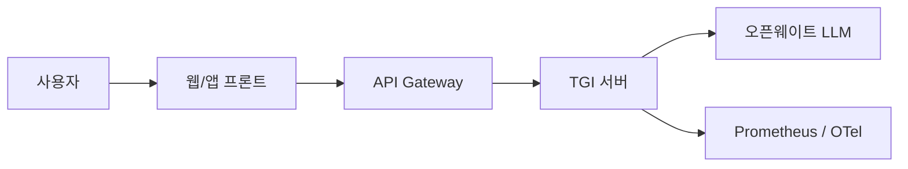
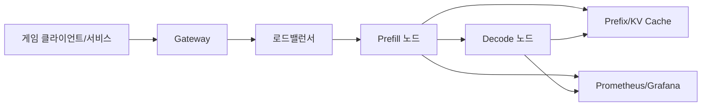
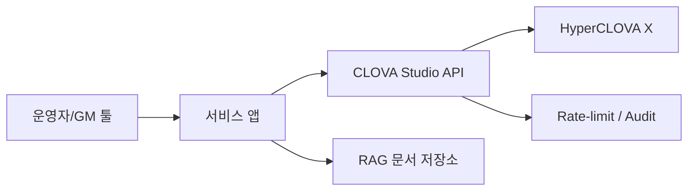

# 한국 게임 프로젝트를 위한 프로덕션 AI 툴링 지형도

## 경영진 요약

2025–2026년 기준으로 프로덕션 LLM 스택은 “에이전트 프레임워크”, “RAG·데이터 계층”, “추론 서버”, “개발자용 CLI 에이전트”가 분리되면서도, 실전에서는 OpenAI 호환 API·MCP·그래프형 워크플로·Prometheus/OTel 계열 관측성으로 다시 수렴하는 방향으로 진화하고 있다. 특히 에이전트 계층에서는 entity["company","Microsoft","software company"]의 Microsoft Agent Framework 1.0이 2026년 4월 GA로 올라서며 AutoGen/ Semantic Kernel 계열의 후속 표준을 자처했고, AutoGen 자체는 공식적으로 유지보수 모드에 들어갔다. 문서·지식 기반 에이전트 영역에서는 LlamaIndex와 Haystack가 여전히 강하며, CrewAI와 DSPy는 각각 워크플로 중심·프로그래밍/최적화 중심의 포지션을 유지한다. citeturn3search1turn3search0turn1search4turn2search3turn5search4turn4search0

한국어 게임 프로젝트의 의사결정 포인트는 일반 SaaS 기업과 다르다. 핵심은 **지연시간**, **피크 동시성**, **실시간 장애 격리**, **데이터 보안**, **운영비 예측 가능성**, 그리고 **한국어 품질**이다. 게임에서는 NPC 대사·퀘스트 생성·GM 도구·라이브 이벤트 운영 보조가 같은 “생성형 AI”라도 서로 다른 SLO를 가진다. NPC 대화는 TTFT와 토큰 간 지연이 중요하고, GM·콘텐츠 운영 툴은 정확한 구조화 출력과 감사 가능성이 더 중요하며, 라이브 이벤트·운영 메시지는 한국어 톤과 안전장치가 핵심이다. 따라서 단일 툴이 아니라 **실시간 경로와 백오피스 경로를 분리한 하이브리드 스택**이 유리하다. citeturn11search2turn11search0turn13search0turn34search6

결론부터 말하면, 한국어 게임 프로젝트의 기본 추천 조합은 다음과 같다. **추론 서버는 vLLM 또는 SGLang**, **RAG 저장소는 pgvector 또는 Qdrant**, **에이전트 계층은 Microsoft Agent Framework 또는 LlamaIndex/Haystack**, **개발자 생산성은 Claude Code·Codex CLI·Gemini CLI·Aider를 혼합**, 그리고 **한국어 모델·API는 Upstage Solar, NAVER HyperCLOVA X/CLOVA Studio, LG EXAONE 계열을 목적별로 섞는 것**이 가장 현실적이다. 단, NVIDIA 단일 하드웨어 표준화와 매우 높은 고정 트래픽이 보장되면 TensorRT-LLM의 성능 상한이 가장 높고, 반대로 로컬/엣지·맥 개발자 환경·경량 오프라인 테스트가 중요하면 llama.cpp의 가치가 매우 크다. 반면 새 프로젝트에서 TGI나 AutoGen을 중심축으로 삼는 것은 2026년 시점에는 권장하기 어렵다. TGI는 유지보수 모드이며, AutoGen은 공식적으로 Microsoft Agent Framework로 승계되었다. citeturn14search1turn14search2turn1search4turn3search1turn19search1turn12search1

## 평가 기준과 게임 프로젝트 가정

이 보고서의 비교는 네 가지 운영 가정을 두고 읽는 것이 가장 정확하다. 첫째, 한국어 비중이 큰 라이브 서비스 게임이며, 둘째, AI를 전면 기능이 아니라 **보조 게임플레이 및 운영 도구**로 도입한다. 셋째, 트래픽 패턴은 이벤트성 스파이크가 있고, 넷째, 개인정보·채팅 로그·운영 지식베이스 일부는 외부 SaaS로 전부 내보내기 어렵다. 아래 TCO와 난이도 평가는 이 가정을 바탕으로 한 **모델링 값**이며, 사용량·지역·GPU 계약단가·저장 용량·관제 인력 수준에 따라 크게 달라질 수 있다.

분류 체계는 다음처럼 보는 것이 실무적으로 가장 유용하다. **에이전트 프레임워크/오케스트레이션**은 멀티스텝 실행, 상태, 도구 호출, 사람 승인, 체크포인트를 담당한다. **RAG 계층**은 임베딩·하이브리드 검색·재랭킹·멀티테넌시와 데이터 거버넌스를 책임진다. **추론 서버**는 모델 로딩, KV 캐시, 배칭, 스케줄링, 분산 추론, 배포 자동화를 담당한다. **CLI 에이전트**는 개발자 워크플로와 코드 저장소 조작, CI 보조, 로컬 승인 정책을 담당한다. 이 네 축이 분리되어 있으면 특정 모델·DB·벤더를 바꾸더라도 전체를 갈아엎지 않고 교체가 가능하다. citeturn3search0turn2search3turn5search4turn11search2turn21search0

게임용으로는 특히 두 개의 지표를 따로 봐야 한다. 하나는 **실시간 대화 경로**의 TTFT, TPOT, 접속자 스파이크 대응력이고, 다른 하나는 **운영 자동화 경로**의 구조화 출력 신뢰도, 재현성, 감사 가능성이다. SGLang과 vLLM 모두 온라인 서빙 벤치마크 도구, 메트릭, 프리픽스/캐시 최적화, OpenAI 호환 서버를 제공하지만, 실제로는 “동일 하드웨어·동일 프롬프트 길이·동일 동시성”으로 재벤치마크하지 않으면 숫자 비교는 쉽게 오해를 부른다. NVIDIA TensorRT-LLM도 공식 성능표를 제공하지만, 엔진 빌드와 NVIDIA 종속성이 크기 때문에 운영 민첩성과 교환해야 한다. citeturn17search2turn17search0turn15search8turn18search2turn13search0

## 에이전트 프레임워크와 오케스트레이션

에이전트 계층은 2026년 현재 “실험적 멀티에이전트 데모 환경”에서 “상태·체크포인트·사람 승인·타입 안정성”이 있는 프로덕션 런타임으로 이동했다. 가장 큰 구조적 변화는 Microsoft Agent Framework의 등장이다. Microsoft는 Agent Framework 1.0을 AutoGen과 Semantic Kernel의 차세대 후속으로 규정했고, 워크플로 그래프, 세션 상태, 미들웨어, MCP, A2A를 전면에 놓았다. 이는 C#·Azure·LiveOps 운영 시스템과 잘 맞는다는 점에서 게임사 백오피스 자동화에 특히 유리하다. 반면 AutoGen은 공식 저장소에서 유지보수 모드 전환과 마이그레이션 권고를 명시하고 있다. citeturn3search1turn3search0turn1search4

LlamaIndex는 여전히 문서 에이전트와 RAG 파이프라인에서 강하다. Workflows는 이벤트 기반으로 RAG, 에이전트, 추출 플로를 구성할 수 있고, 릴리스도 2026년 4월까지 매우 빈번하다. Haystack는 “명시적 파이프라인”이 분명한 장점이며, tracing payload 크기 수정이나 통합 저장소 갱신처럼 운영 지향 업데이트가 꾸준하다. CrewAI는 2026년 4월에도 빠른 릴리스 주기를 보이며 CLI·배포 검증·A2A 문서를 늘리고 있고, DSPy는 에이전트 런타임보다는 “프롬프트 대신 프로그램으로 LLM 파이프라인을 설계하고 최적화”하는 틀로 보는 것이 맞다. 즉, DSPy는 단독 오케스트레이터라기보다 품질·비용 최적화 레이어로 취급하는 편이 실전적이다. citeturn2search0turn2search1turn2search3turn5search1turn5search2turn1search5turn4search1turn4search0

아래 표는 공식 문서·릴리스·저장소 활동을 기준으로, 게임 프로젝트에서 실제 검토 가치가 높은 프레임워크만 추렸다. citeturn3search1turn1search4turn2search0turn5search1turn1search5turn4search1

| 도구 | 목적 | 성숙도·유지보수 | 지원 LLM/배포 | 지연·처리량 관점 | 통합 난이도 | 관측성·보안 | 라이선스·지원 | 예상 TCO |
|---|---|---|---|---|---|---|---|---|
| Microsoft Agent Framework | 장기 상태·멀티에이전트·워크플로 | **높음**. 2026-04 1.0 GA, AutoGen/SK 후속 | Python/.NET, Azure/OpenAI/Anthropic/Ollama 등 | 런타임 자체보다 “상태 관리·오케스트레이션 안정성” 강점 | 중간~높음. 특히 .NET/Azure 친화적 | 세션·미들웨어·체크포인트·텔레메트리 강조 | 오픈소스, 엔터프라이즈 친화 | 초기 3–6주, 월 비용은 추론·관측성에 좌우 |
| LlamaIndex | 문서 에이전트·RAG | **높음**. 2026-04까지 잦은 릴리스 | 다양한 벤더·벡터DB·워크플로 | 실시간보다 문서/지식 경로 최적화 강점 | 중간. Python 팀에 유리 | 자동 계측·외부 observability 연동 | MIT, 커뮤니티 큼 | 초기 2–5주 |
| Haystack | 명시적 파이프라인·RAG·에이전트 | **높음**. 2026-04 업데이트 지속 | 광범위한 모델/스토어 연동 | 파이프라인 제어와 디버깅이 쉬움 | 중간. 설계는 명확, 러닝커브는 다소 있음 | 트레이싱·컴포넌트 단위 제어 | Apache-2.0, deepset 생태계 | 초기 2–5주 |
| CrewAI | 멀티에이전트 워크플로 | **중간~높음**. 2026-04 연속 릴리스 | 다수 외부 모델·A2A 문서화 | 워크플로 중심, 낮은 진입장벽 | 낮음~중간 | 배포 검증 CLI·권한 설계는 상대적으로 성숙 중 | MIT, 상용 확장 존재 | 초기 1–3주 |
| DSPy | 프롬프트/파이프라인 최적화 | **중간~높음**. 활발한 연구·릴리스 | 여러 LLM 백엔드 | 직접 런타임보다는 품질/비용 최적화에 기여 | 중간~높음 | 콜백·추적 지원, 보안은 자체 런타임에 의존 | MIT | 초기 2–4주 |
| AutoGen | 멀티에이전트 프레임워크 | **낮아짐**. 유지보수 모드 | 기존 사용자 유지용 | 신규 채택 비추천 | 신규 프로젝트 기준 비추천 | 후속은 MAF로 이동 | 오픈소스 | 마이그레이션 비용 발생 |

한국 게임 기준 추천은 분명하다. **실시간 NPC/퀘스트/운영 에이전트를 하나의 추론 서버 위에서 통합하고 싶다면 LlamaIndex 또는 Haystack**, **C# 백엔드와 승인을 포함한 운영 워크플로가 핵심이면 Agent Framework**, **실험 속도를 중시하는 소규모 팀이면 CrewAI**, **프롬프트 엔지니어링 대신 자동 최적화를 원하면 DSPy 보조 채택**이 가장 합리적이다. AutoGen은 신규 채택 대상이 아니라 **기존 코드 마이그레이션 대상**이다. citeturn3search1turn1search4turn2search3turn5search4turn1search5turn4search0

## RAG와 데이터 계층

게임용 RAG는 일반 사내 위키 RAG와는 요구사항이 다르다. 질의가 짧고, 한국어와 영어가 섞이며, 버전이 다른 게임 데이터와 라이브 이벤트 규칙이 자주 바뀐다. 그래서 “정확도” 만큼이나 **멀티테넌시**, **필터링**, **하이브리드 검색**, **재색인 운영 비용**, **권한 분리**가 중요하다. 관리형에서는 entity["company","Pinecone","vector database company"], entity["company","Weaviate","vector database company"], entity["company","Qdrant","vector database company"]가 1군이고, 기존 운영 조직에 PostgreSQL이 이미 깊게 들어와 있다면 pgvector가 실무적으로 가장 경제적이다. citeturn6search3turn6search0turn7search1turn8search3

Qdrant는 단일 컬렉션 + 페이로드 파티셔닝 기반 멀티테넌시 설계를 강하게 권장하며, 샤드 승격과 fallback shard 같은 운영 개념이 잘 정리되어 있어 “게임별/지역별/세션별” 파티션 전략을 짜기 좋다. Weaviate는 테넌트별 shard 분리와 하이브리드 검색, 관리형 플랜의 보안 옵션이 강점이다. Pinecone은 서버리스와 Dedicated Read Nodes를 모두 제공해 예측 불가능한 RAG 트래픽과 지속적 고QPS를 분리해 다루기 쉽고, BYOC·Prometheus·로컬 에뮬레이터를 빠르게 강화하고 있다. 반면 pgvector는 Postgres의 ACID, JOIN, PITR을 그대로 가져갈 수 있는 대신, 대규모 ANN·압축·샤딩을 벡터 전용 DB만큼 자동으로 해주지는 않는다. 2026년 2월의 pgvector 0.8.2는 HNSW 관련 보안 수정도 포함하므로 버전 관리가 중요하다. citeturn6search5turn7search1turn9search3turn9search0turn10search1turn10search2turn8search2turn8search3

아래 비교는 공식 가격 페이지·기능 문서·운영 가이드를 기준으로 정리했다. TCO는 “벡터 1천만 건 내외, 임베딩 1024차원, 한국어 문서·게임 데이터 혼합, 월 수십만~수백만 질의”를 상정한 거친 밴드다. citeturn6search0turn6search3turn7search2turn8search3turn10search1

| 도구 | 목적 | 성숙도·유지보수 | 배포 방식 | 지연·처리량 특성 | 통합/언어 바인딩 | 관측성·보안 | 라이선스·커뮤니티 | 예상 TCO |
|---|---|---|---|---|---|---|---|---|
| pgvector | Postgres 내 벡터 검색 | 매우 높음. 생태계 성숙 | 클라우드/온프렘/기존 DB 내장 | 중간 QPS, 강한 트랜잭션 일관성 | 모든 Postgres 클라이언트 | DB 표준 모니터링, ACID, PITR | 오픈소스 | **초기 매우 낮음**, 월 인프라 증분 중심 |
| Qdrant | 고성능 벡터 DB | 높음. Rust 기반, 릴리스 활발 | OSS/Cloud/Managed On-Prem | 하이브리드·필터·멀티테넌시 강함 | Python/TS/Go/.NET/Java/gRPC | 샤딩·복제·보안 가이드 명확 | Apache-2.0 | 중간. Cloud는 사용량 기반 |
| Weaviate | AI-native 벡터 DB | 높음 | 관리형/전용/BYOC/OSS | 하이브리드·멀티테넌시·HA 강점 | 다국어 클라이언트 | RBAC, SSO/SAML, PrivateLink, BYOK | BSD-3-Clause | Flex 시작 약 $45/월, 전용은 상향 |
| Pinecone | 완전관리형 서버리스/전용 읽기 노드 | 높음 | Serverless/DRN/BYOC | 버스트 트래픽은 serverless, 고정 고QPS는 DRN 유리 | SDK·OpenAI 친화 | Prometheus, SAML, CMEK, Audit, Private Networking | 상용 관리형 | Starter 무료, Standard 최소 $50/월+, DRN은 더 높음 |

게임 프로젝트용 권고는 다음처럼 갈린다. **이미 Postgres를 잘 운영하고 있고 인게임 지식베이스 규모가 크지 않다면 pgvector가 가장 빨리 출발할 수 있다.** 반대로 **세션/지역/타이틀 단위 멀티테넌시와 필터가 중요하면 Qdrant**, **관리형 보안과 기업 기능이 중요하면 Weaviate 또는 Pinecone**, **이벤트 기간에만 질의가 폭증하고 평시에는 낮다면 Pinecone serverless**, **항상 높은 QPS가 유지된다면 DRN 또는 self-host Qdrant**가 더 경제적이다. citeturn8search3turn6search5turn9search3turn10search1

## 추론 서버와 CLI 에이전트

추론 계층에서는 vLLM, SGLang, TensorRT-LLM, llama.cpp가 사실상의 핵심 축이다. vLLM은 PagedAttention, 연속 배칭, 분산 추론, Helm/Kubernetes 배포, 구조화 출력, 폭넓은 하드웨어/모델 호환성으로 “기본값” 자리를 유지한다. SGLang은 저지연·고처리량 서빙을 전면에 내세우고, RadixAttention·프리픽스 캐시·분리된 prefill/decode·Prometheus 메트릭·정교한 벤치 도구를 제공한다. TensorRT-LLM은 NVIDIA 하드웨어에서 가장 높은 성능 상한을 목표로 하는 대신, 엔진 빌드와 하드웨어 잠금이 크다. llama.cpp는 CPU·Mac·엣지까지 아우르는 GGUF 생태계와 빠른 릴리스 속도로 독보적이지만, 중앙집중형 고QPS 상용 서빙의 1순위는 아니다. TGI는 여전히 문서가 좋고 운영 기능이 많지만, 2025년 12월부터 유지보수 모드이므로 신규 시스템의 중심으로 쓰기보다 마이그레이션 대상으로 보는 편이 맞다. citeturn11search2turn11search0turn13search0turn12search1turn14search1turn14search2

아래 표는 “NPC 실시간 대화”, “대량 이벤트 브로드캐스트 생성”, “내부 툴용 코드/텍스트 생성”을 함께 고려한 실무 비교다. 절대 성능 숫자는 하드웨어와 프롬프트 길이에 따라 크게 달라지므로, 여기서는 **상대적 특성과 운영 현실성**을 중점으로 읽어야 한다. citeturn17search2turn18search2turn15search8turn14search7

| 도구 | 목적 | 성숙도·유지보수 | 지원 모델/배포 | 지연·처리량 | 요구 HW | 통합 난이도 | 관측성·보안 | 라이선스·지원 | 예상 TCO |
|---|---|---|---|---|---|---|---|---|---|
| vLLM | 범용 고성능 서빙 | 매우 높음. 2026-04 v0.19.1 | NVIDIA/AMD/TPU/Trainium 등, OpenAI 호환 | 기본값 성능 우수, 범용성 최고 | GPU 중심 | 중간 | Prometheus 메트릭 설계, Helm, OTel | Apache-2.0, 커뮤니티 최대급 | 중간 |
| SGLang | 저지연·고처리량 프로덕션 서빙 | 매우 높음. 대규모 채택 공개 | 단일 GPU~분산 클러스터 | 라디كس 캐시·PD 분리 강점 | GPU 중심 | 중간~높음 | Prometheus, profiling, tracing | Apache-2.0 | 중간 |
| TensorRT-LLM | NVIDIA 최고 성능 추구 | 높음 | NVIDIA 전용, Triton 통합 | 최고 상한, 빌드/튜닝 비용 큼 | NVIDIA 필수 | 높음 | Triton 메트릭·엔터프라이즈 지원 | 오픈소스+NVIDIA 생태계 | 높음 |
| llama.cpp | 로컬/엣지/온디바이스 | 매우 높음 | CPU/GPU/Mac/Windows/모바일 | 중앙 서버 QPS는 약하지만 엣지 강함 | 저사양~중사양 가능 | 낮음~중간 | 로컬 중심, 별도 관측성 필요 | MIT | 낮음 |
| TGI | 기존 HF 서빙 스택 | 낮아짐. 유지보수 모드 | HF 생태계 중심 | 운영 기능은 좋지만 신규 채택 비추천 | GPU 중심 | 중간 | Prometheus/OTel 있음 | Apache-2.0 | 마이그레이션용 |

게임 특화 권고는 비교적 명확하다. **한국어 NPC/대화 서비스의 기본값은 vLLM 또는 SGLang**이다. vLLM은 모델 호환폭이 넓고 배포가 쉽다. SGLang은 프리픽스 공유가 많은 반복 대화·유사 컨텍스트 질의에서 특히 매력적이다. **NVIDIA-only와 장기적으로 고정된 모델 세트가 보장되면 TensorRT-LLM**이 비용/토큰 상한을 가장 낮출 가능성이 높다. **게임 클라이언트 개발팀의 로컬 재현, QA, 오프라인 이벤트 도구, Mac 개발환경**에는 llama.cpp를 병행하는 것이 좋다. TGI는 HuggingChat 같은 기존 시스템에는 의미가 있지만 신규 메인 라인에는 비추천이다. citeturn19search1turn11search0turn13search0turn12search1turn14search1

CLI 에이전트는 내부 개발 생산성 체인에서 매우 중요해졌다. entity["company","Anthropic","ai company"]의 Claude Code는 세밀한 권한 시스템, 관리형 MCP, 비용 관리 문서가 강점이며, 팀 플랜에서 Claude Code 포함 Premium seat를 별도 제시한다. entity["company","OpenAI","ai company"]의 Codex CLI는 ChatGPT 플랜 통합과 로컬 터미널 에이전트 경험이 강점이지만 2026년 4월 토큰 기반 크레딧 체계로 바뀌었고, 동시에 0.120.0 윈도우 패키징 이슈처럼 빠른 변화에 따른 운영 잡음도 보였다. entity["company","Google","technology company"]의 Gemini CLI는 오픈소스, 헤드리스 JSON 출력, MCP, 샌드박싱, 개인 계정 무료 티어가 강점이다. Aider는 좌석 비용 없이 API 패스스루로 동작하고, architect mode, 다양한 모델 연결성, Git 중심 워크플로가 강점이다. citeturn21search0turn21search2turn21search6turn20search0turn20search2turn22search0turn23search1turn23search7turn24search7turn21search3turn21search5turn25search0turn26search0turn31search2turn31search0

| 도구 | 권장 용도 | 성숙도 | 보안/승인 | 자동화/CI | 비용 구조 | 게임 개발팀 적합성 |
|---|---|---|---|---|---|---|
| Claude Code | 대형 코드베이스, 안전한 팀 운영 | 높음 | 매우 강함. 세밀한 권한·managed MCP | 좋음 | Team Premium seat $150/인/월, API형도 가능 | 엔진/서버 공용 리포, 보안 민감 팀에 적합 |
| Codex CLI | OpenAI/ChatGPT 통합 중심 개발 | 높음이나 변화 빠름 | 로컬 중심, 승인/샌드박스 문서화 | 좋음 | ChatGPT 플랜 포함 + 2026-04부터 토큰형 크레딧 | OpenAI 중심 조직에 적합, 운영 안정성은 체크 필요 |
| Gemini CLI | 오픈소스·헤드리스 자동화 | 높음 | 샌드박싱 문서화 | 매우 좋음. JSON/JSONL 출력 | 무료 시작, API 전환 시 Gemini 과금 | 배치 스크립트·CI 보조·내부 도구에 특히 유리 |
| Aider | API-first, 모델 자유도, Git 중심 | 높음 | 로컬/Git 중심, 중앙 통제는 약함 | 좋음 | 좌석 비용 없음, 모델 API 비용만 부담 | 실험 속도, 비용 통제, 다중 벤더 전략에 유리 |

한국 게임사 관점에서 가장 실용적인 조합은 **조직용 표준은 Claude Code 또는 Codex CLI**, **배치 자동화와 CI는 Gemini CLI**, **개별 개발자 실험과 저비용 멀티벤더 운용은 Aider**다. 중요한 점은 하나로 통일하는 것이 아니라, **승인 강도와 사용 맥락에 따라 도구를 나누는 것**이다. 예를 들어 메인 게임 서버와 결제·운영 시스템은 Claude Code처럼 권한 모델이 강한 도구를 쓰고, 빌드 스크립트·데이터 검증·로그 분석은 Gemini CLI/Aider로 분리하는 편이 낫다. citeturn21search2turn20search0turn23search7turn25search0turn31search2

## 한국어 생태계, 사례 연구, 비용과 최종 권고

한국어 지원은 단순히 “한국어를 출력할 수 있음”이 아니라, **한국어 임베딩**, **한국 문화/게임 문맥 이해**, **OpenAI 호환 API**, **국내 데이터 거버넌스**, **상용 라이선스 조건**까지 봐야 한다. entity["company","NAVER","technology company"]의 HyperCLOVA X는 한국어 문화·사회 맥락 이해를 강하게 강조하며, CLOVA Studio에서는 HCX-007/005/DASH 계열, 함수 호출, 구조화 출력, OpenAI compatibility, 임베딩 모델, 서비스 앱 승인 절차, 사용량 제어 정책을 제공한다. 다만 소비자용 CLOVA X 서비스는 2026년 4월 9일 종료되었고, 실운영 채널은 CLOVA Studio/NCP 측으로 이해하는 것이 맞다. citeturn32search8turn34search3turn34search6turn34search7turn34search9turn32search9

entity["company","Upstage","ai company"]는 OpenAI SDK base_url만 바꾸는 방식의 API 예시를 문서에 직접 제공하고, 채팅·reasoning·문서 파싱·임베딩·LangChain/LlamaIndex 예시까지 노출한다. 이는 한국어 게임사가 “국산 모델이면서도 기존 Python 스택을 크게 바꾸지 않고” 붙이기 쉽다는 의미다. entity["organization","LG AI Research","Seoul, South Korea"]의 EXAONE 계열은 한국어·영어 모델 카드, AWQ/GGUF 배포, 2026년 4월 EXAONE 4.5의 오픈웨이트 VLM 공개까지 연결되지만, 라이선스가 일반 Apache/MIT가 아니라 `exaone` 라이선스라는 점은 상용 게임 배포 전 반드시 법무 검토가 필요하다. entity["company","Kakao","internet company"]는 2026년 Kanana API와 공개 모델을 확장하며 에이전트형 툴 호출 효율을 강조했다. citeturn33search2turn33search3turn33search4turn35search8turn35search3turn35search4turn32search3turn32search7

### 공개 검증 사례와 게임용 참조 아키텍처

공개 소스 셋에서 **한국 게임사의 상세한 프로덕션 LLM 아키텍처**를 공식적으로 검증할 수 있는 사례는 확인하지 못했다. 따라서 아래는 공개적으로 검증 가능한 실서비스 또는 대규모 채택 사례를 우선 제시하고, 마지막에 게임 프로젝트로 번역한 참조 구조를 붙인다. 실제 게임사 적용 시에는 이 구조를 기준선으로 보고, 보안·트래픽·운영 조직에 맞게 좁혀야 한다. citeturn14search2turn12search4turn34search1

**사례 A — HuggingChat/TGI 계열:** TGI 공식 문서는 HuggingChat, OpenAssistant, nat.dev 등에서 프로덕션 사용 사례를 직접 언급한다. 2026년 현재 TGI는 유지보수 모드이므로, 이 사례는 “기존 HF 계열 운영 스택의 안정적 레퍼런스”로 보되 신규 구축 기준으로는 vLLM/SGLang 이행 경로까지 함께 설계해야 한다. citeturn14search2turn14search1

**사례 B — SGLang 대규모 채택 계열:** SGLang은 공식 문서와 저장소에서 xAI, LinkedIn, Cursor를 포함한 대규모 채택과 40만+ GPU, 일일 수조 토큰 생성 규모를 공개하고 있다. 세부 아키텍처는 공개되지 않았지만, 공식 기능 조합을 보면 실전 패턴은 “OpenAI 호환 엔드포인트 + prefix-aware caching + 분리된 prefill/decode + Prometheus”로 수렴한다는 점을 읽을 수 있다. 이 패턴은 한국어 NPC 대화에도 매우 잘 맞는다. citeturn11search0turn12search4turn14search7turn17search2

**사례 C — 한국어 실서비스 플랫폼 계열:** CLOVA Studio는 HyperCLOVA X 기반의 프로덕션용 서비스 앱, OpenAI 호환 호출, 함수 호출/구조화 출력, 사용량 제한 헤더, 서비스 앱 승인 절차를 제공한다. 공개 고객 아키텍처는 아니지만, 한국어 중심 엔터프라이즈 서비스의 운영 패턴을 가장 잘 보여주는 국내 레퍼런스 중 하나다. 게임사 입장에서는 NPC 운영 콘솔, 라이브 공지 생성, 한국어 GM 어시스턴트에 바로 번역하기 쉽다. citeturn34search1turn34search3turn34search6turn34search9

### 통합 복잡도와 마이그레이션 리스크

가장 안전한 조합은 **에이전트 계층과 추론 계층을 분리**하는 것이다. OpenAI 호환 API 덕분에 Upstage, CLOVA Studio 일부, vLLM, SGLang, TGI, llama.cpp는 상위 애플리케이션 변경을 줄일 수 있다. 하지만 실제 마이그레이션 리스크는 API 형식이 아니라 **도구 호출의 세부 차이**, **구조화 출력 제약**, **reasoning 토큰 처리**, **모델별 토크나이저/임베딩 변경**, **벡터 재색인 비용**에서 발생한다. 특히 AutoGen→MAF, TGI→vLLM/SGLang, 관리형 벡터DB→pgvector/Qdrant 전환은 모두 “기능 부족”이 아니라 “운영 개념과 상태 모델 변화”가 더 큰 리스크다. citeturn1search4turn3search1turn14search1turn10search0turn34search3

| 영역 | 낮은 복잡도 | 중간 복잡도 | 높은 복잡도 | 주요 리스크 |
|---|---|---|---|---|
| 에이전트 프레임워크 | CrewAI | LlamaIndex / Haystack | MAF | 상태 모델, 체크포인트, 승인 플로 |
| 벡터 계층 | pgvector | Qdrant | Pinecone/Weaviate ↔ self-host 전환 | 재색인, 멀티테넌시 설계 |
| 추론 서버 | llama.cpp | vLLM | SGLang / TensorRT-LLM | KV 캐시, 분산 설정, 하드웨어 종속성 |
| CLI 에이전트 | Aider | Gemini CLI | Claude Code / Codex CLI 조직 표준화 | 권한 정책, 좌석비, 워크플로 고착 |

### 비용 산정 방법론과 예시 시나리오

비용은 세 층으로 나눠 봐야 한다. **초기비용**은 PoC 설계, 프롬프트/평가셋 구축, 오케스트레이션 연결, 보안 검토, 관측성 대시보드에 들어간다. **월 운영비**는 모델 호출 또는 GPU, 벡터 저장소, 로그/트레이싱, 개발자 CLI 좌석비로 구성된다. **숨은 비용**은 재색인, 모델 업그레이드 검증, 레드팀/안전성 테스트, 그리고 이벤트성 과부하 대비 예비 용량이다.

예시로 보면, **프로토타입 단계**에서는 Gemini CLI 무료/저가 모델, Claude Code 또는 Codex CLI 일부 좌석, pgvector, Upstage 또는 CLOVA Studio API로 월 수십~수백 달러 수준에서도 충분히 출발 가능하다. **싱글 타이틀 파일럿**은 vLLM/SGLang 한두 노드, Qdrant 또는 Pinecone/Weaviate 소형 플랜, 5–10개 개발자 CLI 좌석을 포함해 대략 월 수천~1만 달러대가 현실적이다. **실시간 NPC를 라이브 운영하는 본격 상용 단계**는 다중 GPU, 고가용성, 전용 벡터 서비스, 24/7 관제, 다국어 평가 파이프라인 때문에 월 수만 달러대로 올라간다. 이때 관리형 DB의 최소 가격은 Weaviate Flex 약 $45/월, Pinecone Standard 최소 $50/월부터 시작하며, Claude Team Premium seat는 인당 $150/월이다. Gemini 2.5 Flash는 표준 입력 $0.30/1M, 출력 $2.50/1M이고, Gemini 2.5 Pro는 입력 $1.25/1M, 출력 $10/1M이다. Claude API는 Sonnet 4 기준 입력 $3/1M, 출력 $15/1M이며, Claude Code 엔터프라이즈 평균은 활성 개발자당 월 $150–250 수준으로 안내된다. citeturn6search0turn6search3turn20search2turn20search0turn29view0turn20search1

### 최종 권고와 결정 체크리스트

한국어 게임 프로젝트에 대한 최종 권고는 세 문장으로 정리할 수 있다. **첫째, 지금 바로 시작하는 기본 스택은 vLLM 또는 SGLang + pgvector 또는 Qdrant + LlamaIndex/Haystack/MAF + Claude Code/Gemini CLI/Aider 조합이다.** **둘째, 한국어 품질이 핵심이면 Upstage와 CLOVA Studio를 초기 API 백본으로 검토하고, 온프렘 비용 절감 단계에서 EXAONE 또는 다른 오픈웨이트 한국어 모델을 self-host로 치환한다.** **셋째, NVIDIA 단일 표준화와 고정 대규모 트래픽이 확인되기 전까지는 TensorRT-LLM을 1차 기본값으로 두지 않는다.** citeturn33search2turn34search3turn19search1turn11search0turn8search3turn7search1turn13search0

결정 체크리스트는 다음 순서가 가장 좋다. **실시간 경로와 백오피스 경로를 분리했는가.** **모델 교체 시 OpenAI 호환 API로 흡수 가능한가.** **임베딩 모델과 벡터 스토어를 동시에 잠그지 않았는가.** **한국어 평가셋을 별도로 운영하는가.** **구조화 출력과 함수 호출이 실제 운영 포맷과 맞는가.** **TTFT/TPOT/오류율/환각률/콘텐츠 안전성 지표가 한 대시보드에 보이는가.** **CLI 에이전트의 권한 시스템이 리포 민감도와 맞는가.** **라이선스가 상용 게임 운영에 문제없는가.** 특히 EXAONE 계열은 성능 이전에 라이선스 검토가 선행되어야 한다. citeturn35search8turn35search3turn21search2turn34search6

### 열린 질문과 한계

이번 소스 셋에서는 공개적으로 검증 가능한 **한국 게임사의 상세 프로덕션 LLM 아키텍처**를 확보하지 못했다. 따라서 사례 연구는 공개 실서비스 및 공개 채택 사례를 중심으로 구성했고, 게임용 아키텍처는 그 위에 보수적으로 번역했다. 또한 성능 수치는 프로젝트별 벤치마크 조건이 달라 절대 비교가 아니라 **운영 특성 비교**로 읽어야 한다. 마지막으로, self-host GPU 원가와 인프라 단가는 계약·지역·예약 방식에 따라 크게 변하므로, 보고서의 TCO는 **의사결정용 범위 추정**으로 보는 것이 적절하다. citeturn17search2turn18search2turn20search0